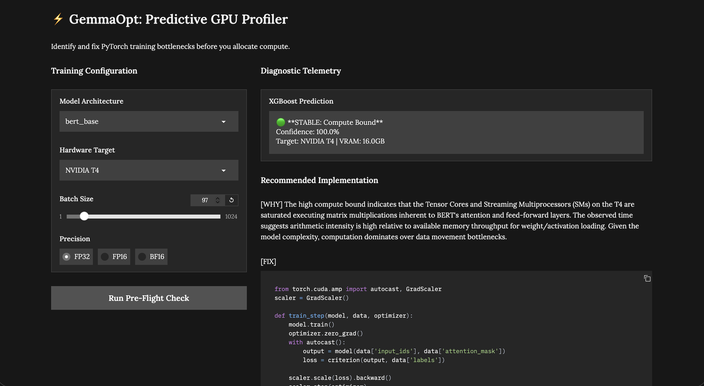
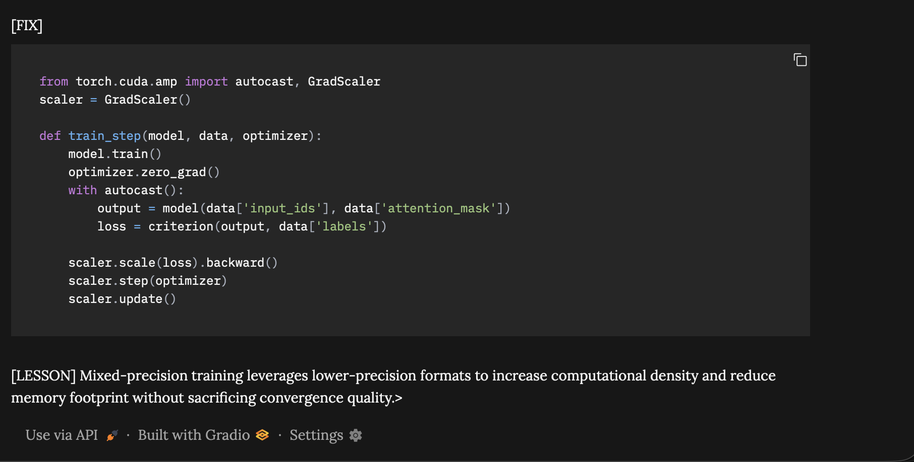

# G4-opt
# ⚡ GemmaOpt: Predictive GPU Profiler & Auto-Optimizer

## Overview
GemmaOpt is a hybrid AI diagnostic tool designed to predict and resolve PyTorch training bottlenecks before compute is allocated. By combining a predictive machine learning engine with a large language model, GemmaOpt identifies potential Out-of-Memory (OOM) crashes and generates production-grade, hardware-specific PyTorch code optimizations.

## Architecture
1. **Predictive Profiler (XGBoost):** Analyzes training configurations (Batch Size, Precision, GPU VRAM, Bandwidth) to forecast bottlenecks (Compute Bound, Memory Bound, OOM) with 99.9% accuracy.
2. **Generative Optimizer (Gemma-4):** Acts as a virtual GPU engineer. It ingests the XGBoost telemetry and generates drop-in PyTorch fixes (e.g., gradient checkpointing, mixed precision) using a localized Hugging Face `Transformers` pipeline.
3. **Interactive UI (Gradio):** A web dashboard for researchers to run pre-flight checks on their training runs.

## Tech Stack
* **Machine Learning:** XGBoost, Scikit-learn, Pandas
* **Deep Learning/LLM:** PyTorch, Hugging Face Transformers, Google Gemma-4 (bfloat16)
* **Frontend:** Gradio Web UI
* **Environment:** Kaggle / Jupyter Notebooks

## Core Features
* 🚦 **Pre-Flight Telemetry:** Predicts OOM crashes and bottlenecks based on target hardware (e.g., NVIDIA T4, A100, RTX 4090).
* 🛠️ **Automated Code Generation:** Outputs strict, highly technical PyTorch fixes without relying on generic advice (like simply "lowering the batch size").
* 🔒 **Local Execution:** Uses locally hosted model weights for offline, privacy-first inference.
## ⚡ Technical Proof: GemmaOpt Dashboard

### I. Predictive Telemetry Interface
The Gradio-based profiler monitors hardware states in real-time, identifying bottlenecks before training begins.

### II. Automated Remediation Logic
The system utilizes an XGBoost classifier to provide specific code-level fixes (e.g., Automated Mixed Precision) based on detected hardware constraints.

## Usage
Simply launch the Gradio interface, input your model architecture, desired batch size, precision (FP32, FP16, BF16), and target GPU. The system will output the diagnostic telemetry and the recommended implementation.
